# Agent Office

> [!WARNING]
> **🚧 Heavily under active development.** Agent Office is pre-1.0 and changes fast. Expect breaking changes, half-built features, rough edges, and undocumented behaviour. Data formats and the on-disk layout under `~/.claude/` may change without migration. **Back up your data, and don't rely on it for anything critical.**

> Your Claude Code agents, visualized as a living isometric office. Summon, orchestrate, and watch them work in real time.

Personal multi-agent IDE for developers running 3+ Claude Code subagents on real projects. Pick a project, scope a roster, drop a prompt, see streamed output - all inside a dark desktop shell with a pixel-art office floor.

## Screenshots

**Inside a project** — live runs, roster, environment, and stats at a glance:

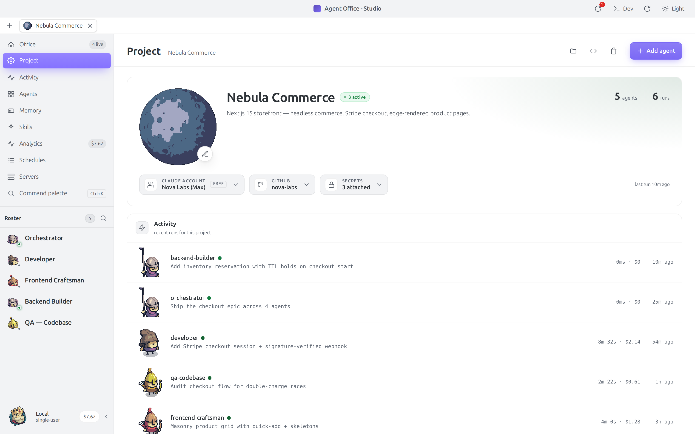

**Multi-agent orchestration** — one agent plans and dispatches sub-agents (done · running · queued), streamed back into the chat:

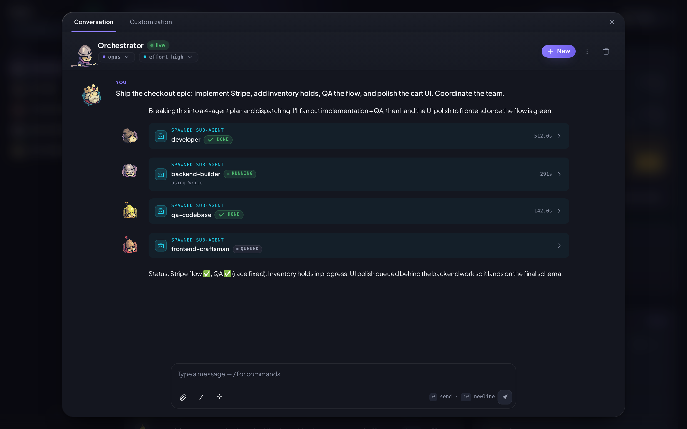

**Every project, one tab bar away** — switch context without losing your place:

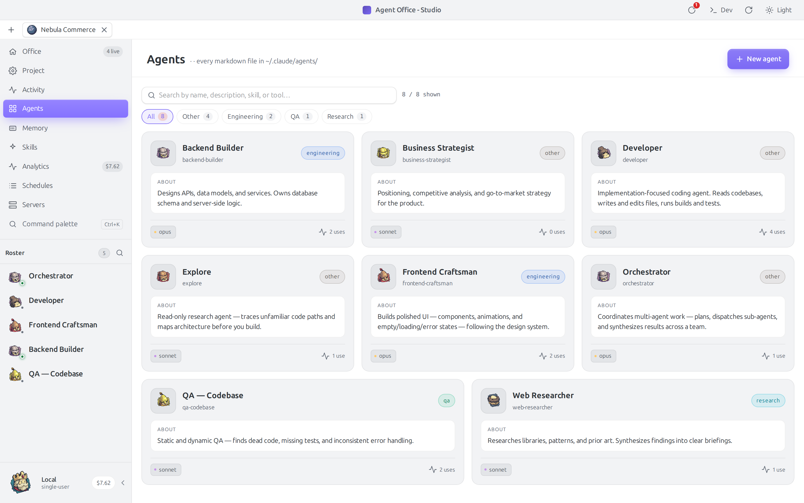

<details>
<summary><b>More screenshots</b> — chat, activity, agents, memory, skills, analytics, schedules, servers</summary>

|  |  |
| --- | --- |
| Agent chat with a spawned sub-agent | Activity feed |
| 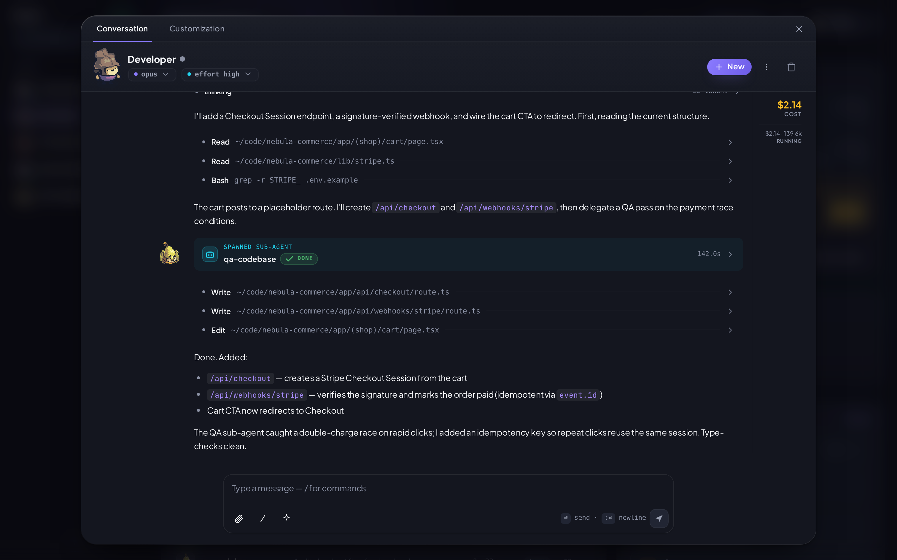 | 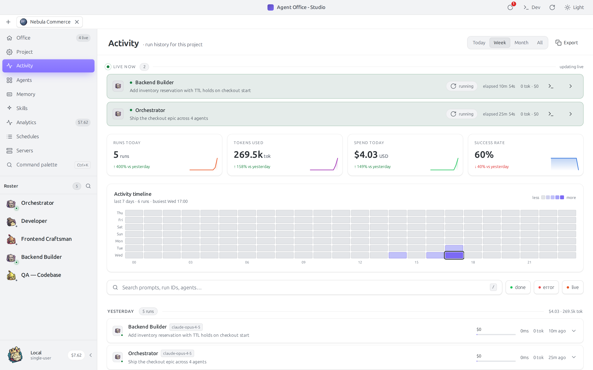 |
| Rate-limited run | Interrupted run |
| 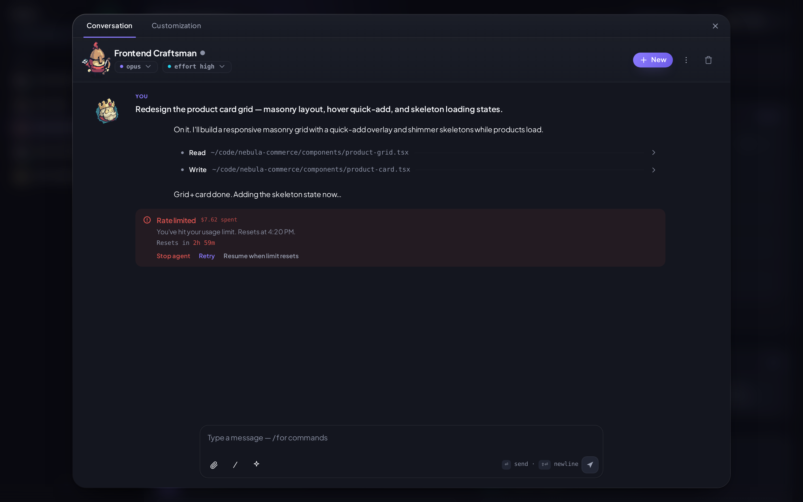 | 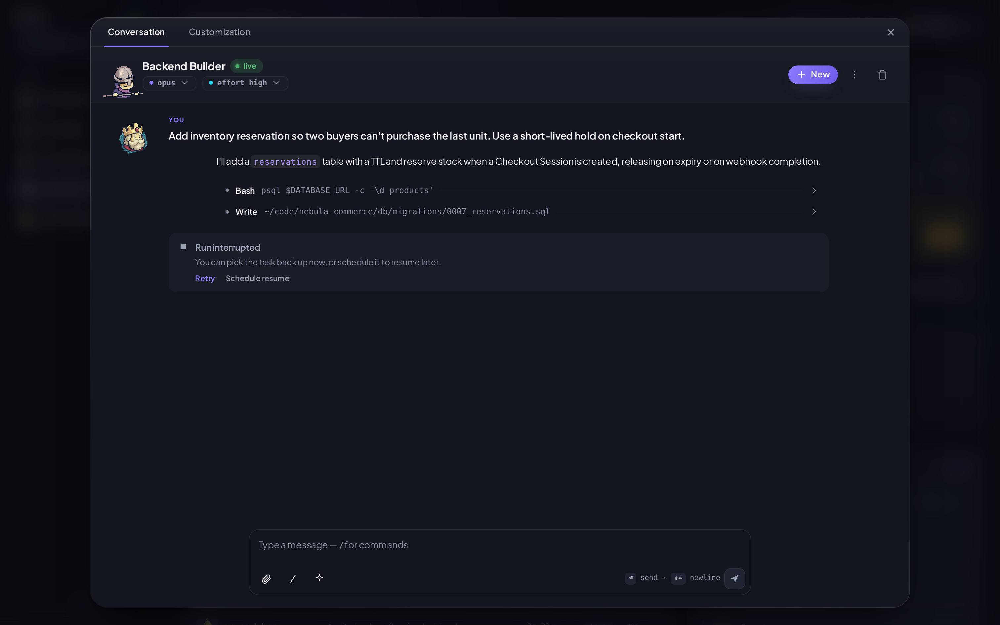 |
| Agents library | Memory (global · project · per-agent) |
|  | 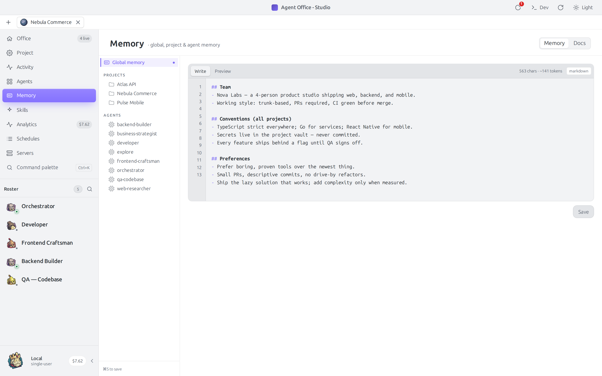 |
| Skills registry | Cost analytics |
| 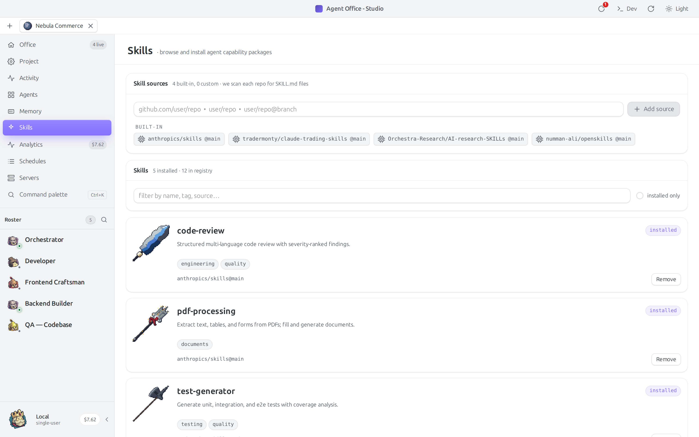 | 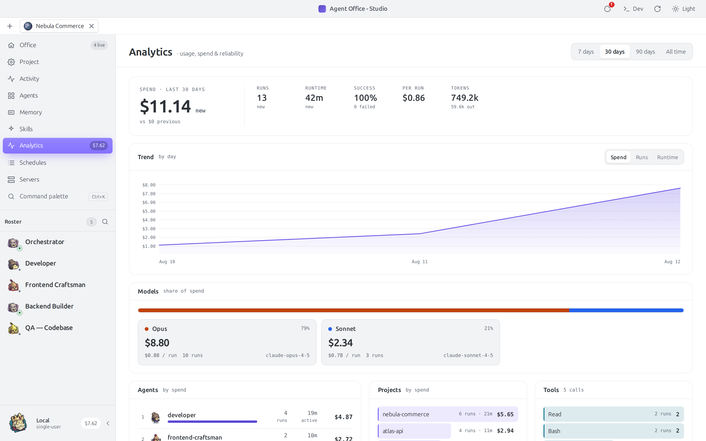 |
| Scheduled tasks | Running servers |
| 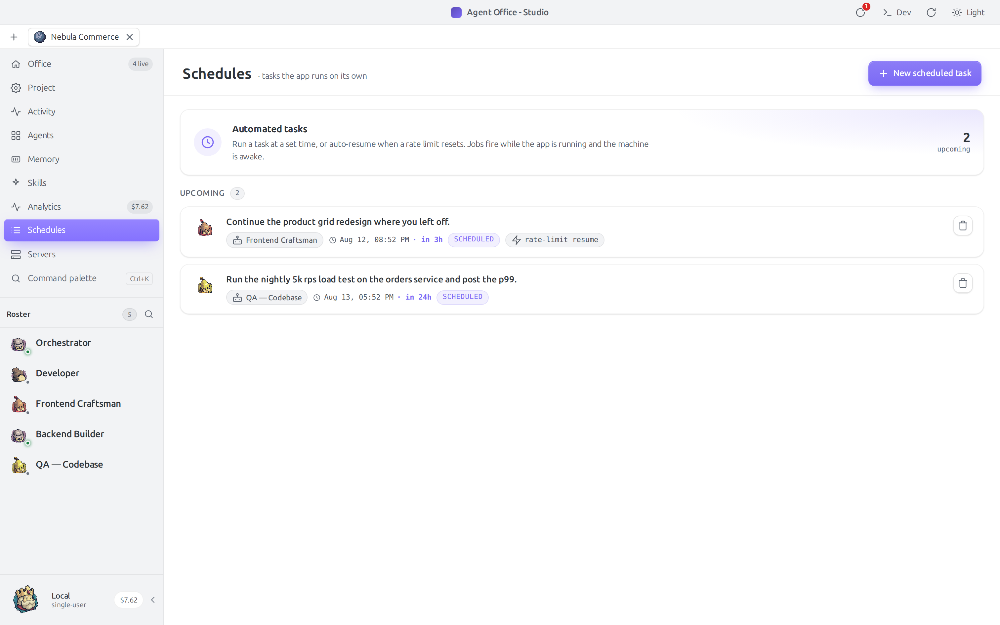 | 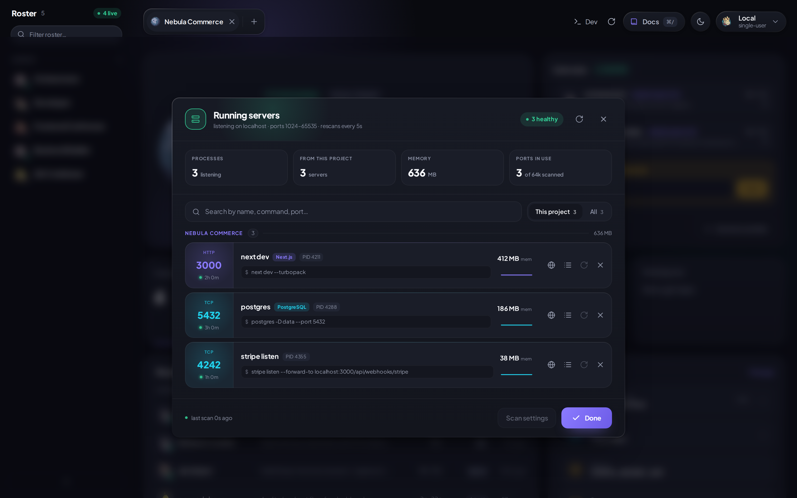 |

</details>

<sub>Screenshots are captured against a fake, leak-free demo dataset — see [`scripts/screenshot-app.sh`](scripts/screenshot-app.sh).</sub>

## Features

### Orchestration
- **Summon** any agent against any project with live SSE-streamed output and full transcript history
- **Workflow spawn tree** - live sub-agent tree with per-node status badges and cost; shown in chat via the WorkflowPill dropdown while an orchestration is running
- **Multi-instance agents** - run the same agent 3x in parallel on different scopes (each gets its own transcript, draft, and run history)
- **Pipelines** - multi-step orchestrator dispatch: one agent plans, dispatched subagents execute, results streamed back
- **Workflows library** - a curated set of reusable, multi-step prompts; opened from the composer (Ctrl+P) or saved from any message
- **Abort all** - kill every running agent with one click
- **Rate-limit warning** - dedicated card in the chat thread when a run hits API rate limits

### The office
- **Isometric pixel-art floor** rendered with Pixi.js - drag agents from the sidebar onto grass tiles, decorate the scene, persist to SQLite
- **Animated unit sprites** - 5 factions × 5 unit kinds (Pawn, Warrior, Archer, Monk, Lancer); each agent gets a sprite set by its `unit` frontmatter field
- **Pawn action animations** - working pawns switch sprite sheets based on surroundings: axe near trees, pickaxe on rocks, knife near sheep, hammer otherwise
- **5 grass color themes** - Meadow (yellow), Forest (green), Spring (light), Marsh (olive), Frost (teal); per-scene choice
- **Cards view** - toggle between isometric grid and compact card layout from the office toolbar
- **Build mode** - paint terrain, flood-fill (F), place 60+ decorations, swap grass colour, full undo/redo (Cmd+Z), decoration search
- **Auto-tiling path tiles** - dirt paths connect to cardinal neighbours automatically; drawn via PixiJS Graphics (no PNG dependency)
- **Bridges** - place horizontal/vertical bridge planks on water; end-caps auto-render on adjacent land tiles; agents stand elevated on bridges
- **Voronoi water shader** - animated teal cellular water pattern behind the island
- **Pixel-planet project icons** - each project gets a deterministic procedural WebGL2 planet icon (15 types: gas giant, rocky, terran, toxic, ice, islands, lava, ice moon, eclipse, black hole, galaxy, star, asteroid, comet, ringed terran)
- **Smooth pan/zoom** - Ctrl+Scroll zooms to cursor; arrow keys / drag to pan

### Knowledge & memory
- **Per-agent memory editor** - edit `~/.claude/agents/<id>.md` definitions inline
- **Global memory editor** - manage the machine-wide `CLAUDE.md`
- **Skills registry** - browse, install, and auto-update Claude Skills from configured sources
- **Docs viewer** - in-app browser for exported run docs

### Discovery & history
- **Global search** across every run, message, and transcript
- **Activity feed** - chronological view of every summon
- **Spend tracking** - cost-per-agent, cost-per-project, daily totals
- **Run detail pages** - full transcript with cost, tokens, model, duration
- **Analytics dashboards** - spend/runs/runtime trends, model split, per-agent and per-project rankings, tool usage, activity heatmap; per-account breakdown when multiple Claude accounts are connected
- **Command palette** (Cmd/Ctrl+K) - jump to any page plus quick actions (toggle theme, abort all runs, open the Processes and Flutter panels)

### Integrations
- **Multi-account** - connect several Claude accounts, see per-account usage in Analytics, and switch the account a run bills against
- **GitHub accounts** - register GitHub identities per project for worktree/PR work
- **Git worktrees** - each project's worktree tree is tracked and surfaced; missing worktrees auto-recreated on next summon
- **Branch detection** - active branch shown next to project
- **Dev-server tracking** - long-running dev servers managed and visible in the Processes modal
- **Clipboard image paste** - paste screenshots straight into the composer
- **Usage & spend** - read-only daily spend and per-agent cost over a day / week / month period, plus your Claude plan badge (from local run history; not a read of Anthropic's account limits, and no dollar cap is enforced)
- **Sleep inhibitor** - keeps the machine awake while runs are streaming

### Reliability
- **Crash recovery** - orphan runs left over from a crash are auto-marked on next boot; interrupted pipelines surface a recovery banner
- **Self-healing worktrees** - if an instance's worktree directory goes missing, it is recreated automatically rather than bricking the instance
- **Atomic file writes** for every persisted markdown asset
- **WAL-mode SQLite** with foreign keys on
- **Export/import** the full app state for backup or migration

### Platform
- **Browser** at `localhost:3000` for daily use
- **Tauri desktop bundle** with a custom titlebar (traffic-light window controls)
- **Mobile bottom nav** - navigate between pages on a phone (the isometric office itself is desktop-first, not yet responsive)
- **i18n** via next-intl (English shipped, structure for more)

## Stack

- **Next.js 16** (App Router) + **React 19** + **TypeScript**
- **Tailwind CSS v4** + custom design system (dark "Obsidian" theme, violet accent `#7c6af5`)
- **Pixi.js v8** for the isometric office canvas (GPU-accelerated; PixiJS Graphics for procedural path tiles)
- **`@agent-office/pixel-planets`** and **`@agent-office/pixel-icons`** — own-authored procedural renderers, kept as separate repos: WebGL2 planet icons (one shared GL context for all of them) and canvas-2D weapon/shield icons
- **Zustand** for client stores, **TanStack Query** + **axios** for server state (API calls live in `src/lib/api/` modules — see [`docs/data-fetching.md`](docs/data-fetching.md))
- **better-sqlite3** at `~/.claude/agent-office/db.sqlite` - runs, messages, transcripts, drafts, pipelines, workflows, UI state
- **framer-motion** for page + modal transitions
- **zod** for validation at every trust boundary
- **Tauri v2** for desktop bundling
- The API (`apps/server`) is web-standard Request/Response handlers: the desktop app mounts them inside Next.js, `pnpm server` runs them headless. It shells out to `claude -p` per summon and streams stdout back over SSE

## Monorepo

```
apps/
  server/         @agent-office/server — the HTTP API + SSE runner (routes, boot tasks, standalone entry)
  web/            @agent-office/web — the UI (Next.js), which also hosts the server in the desktop app
  minecraft-mod/  NeoForge mod — a second client of the same API (Gradle, not part of the pnpm workspace)
packages/
  domain/         @agent-office/domain — the brains: types, DB layer, services (runs, agents, pipelines, skills, worktrees, accounts, ...)
  api-contract/   @agent-office/api-contract — API paths + request schemas shared by the server and every client
```

Dependencies point one way: `web` → `api-contract` (+ domain types) → `domain`, and
`server` → `api-contract`, `domain`. The UI never calls domain services; it talks to
the server over HTTP like any other client. Lint enforces it (`docs/conventions.md`).

The two
procedural-icon renderers used to live here and are now standalone
repositories, pinned by commit as git dependencies in `apps/web/package.json`:
[`pixel-planets-generator`](https://github.com/nakotomagami-a11y/pixel-planets-generator)
(`@agent-office/pixel-planets`) and
[`pixel-weapons-generator`](https://github.com/nakotomagami-a11y/pixel-weapons-generator)
(`@agent-office/pixel-icons`).

Inside `apps/web/src`:

- `app/(app)/` - pages: office (root `/`), activity, analytics, projects, agents, runs, search, memory, skills, docs, settings
- `app/api/[...path]/` - mounts `@agent-office/server`; the endpoints themselves live in `apps/server/src/routes/`
- `components/layout/` - window chrome, titlebar, sidebar, project switcher, mobile nav
- `components/ui/` - design-system atoms (Icon, StatusDot, Button, Modal, Tabs, ...)
- `components/command-palette/` - Cmd+K palette
- `modules/office/` - isometric scene, Pixi canvas, build toolbar, map overlay
- `modules/summon/` - chat panel, transcript thread, composer, workflow picker, live status
- `modules/workflows/` - workflow (reusable multi-step prompt) picker dialog
- `modules/analytics/` - spend/usage dashboards
- `modules/accounts/`, `modules/github-accounts/` - multi-account management
- `modules/processes/`, `modules/limits/`, `modules/memory/`, `modules/skills/`, `modules/projects/`, `modules/agents/`, `modules/runs/`, `modules/search/`, `modules/settings/`, `modules/docs/`, `modules/flutter/`, `modules/onboarding/`
- `lib/` - Zustand stores (theme, active-project, tabs, claude-limits, processes, dev-server, branch, palette, flutter, performance, compare, toast, ...), the axios `api-client`, and `api/` resource modules

## Run it

Requires **Node 22+** and **pnpm**.

```sh
pnpm install
pnpm dev              # → http://localhost:3000

pnpm build            # next build of apps/web
pnpm start            # production server
pnpm server           # the API alone, no UI (http://127.0.0.1:3001)
pnpm typecheck        # tsc --noEmit across the workspace
pnpm lint
```

Desktop bundle:

```sh
pnpm --filter @agent-office/web tauri:dev
pnpm --filter @agent-office/web tauri:build
```

## Installing a release build (unsigned)

Pre-built release binaries cover **Linux** (`.deb`, AppImage) and **Windows**
(`*-setup.exe`, NSIS). macOS is source-build-only.

**Nothing is code-signed**; a certificate per platform costs money per year and
this is a personal project. Linux has no OS-level gate, so the `.deb` and
AppImage install as-is. Windows SmartScreen will warn on an unsigned installer —
*More info* → *Run anyway*.

Only the *updater* artifacts are signed (a minisign key, so the in-app updater
can verify what it downloads). That is unrelated to OS-level trust.

On any platform, **build from source** instead of using a downloaded binary —
`tauri:build` output is never quarantined, because it was never downloaded:

```sh
pnpm --filter @agent-office/web tauri:build
```

To build the working tree *and* install it over your current copy in one step:

```sh
pnpm install:local           # Linux: builds a .deb, installs it with dpkg
pnpm install:local:windows   # Windows: builds the NSIS installer, runs it silently
```

The Windows script refuses while Agent Office is running, because the installer
terminates the app — and the app hosts the agent runs, so an agent that installs
over its own host kills its own run mid-task.

## Architecture notes

- **Agent definitions** are markdown files in `~/.claude/agents/`. The app scans that directory to build the roster and lets you edit definitions inline.
- **Summon** shells out to `claude -p "<prompt>"` per run; stdout streams back over SSE to the chat panel and persists to SQLite as it arrives.
- **Pipelines** are stored as a parent `pipelines` row plus N `pipeline_steps` children; each step is its own `claude -p` invocation, dispatched by the orchestrator agent and tracked independently.
- **Workflows** (a curated library of reusable multi-step prompts, formerly "saved prompts") live in the `saved_prompts` SQLite table; the picker dialog is one keystroke away in the composer (Ctrl+P) and organised by category.
- **Skills** are installable bundles from configured registries; updates are checked against source manifests and surfaced in the Skills page.
- **Sleep inhibitor** acquires a `systemd-inhibit` lock for the duration of any active run so the laptop doesn't sleep mid-task.
- **Crash recovery**: on DB open, any run still marked `running` is flipped to `error` with `exit_code=-1`; any pipeline still `running` is marked `interrupted=1`.

## Status

Personal project, still heavily under development. Not production-grade for shared use - assumes a single local user with `claude` on `$PATH` and a populated `~/.claude/agents/` directory.

Release builds are unsigned, and cover Linux and Windows only — see [Installing a release build](#installing-a-release-build-unsigned). macOS requires building from source.

## License

[GPL-3.0-or-later](LICENSE) — and not by preference. The app links
`@agent-office/pixel-icons`, whose `blades` and `spears` generators are ports of
[Icon Machine](https://github.com/BrianMacIntosh/icon-machine), which is
GPL-3.0. A port is a derivative work, so the combined work inherits
GPL-3.0-or-later.

In practice: read it, run it, modify it, redistribute it, commercially or not —
but anything you ship built on this carries the same licence and must offer the
same complete source to whoever receives it. There is no take-it-private path,
which is the point.

The two procedural-icon renderers are separate repositories on their own terms,
and stay redistributable on them independently of this app:

| Package | Terms |
|---|---|
| [`pixel-planets-generator`](https://github.com/nakotomagami-a11y/pixel-planets-generator) | MIT |
| [`pixel-weapons-generator`](https://github.com/nakotomagami-a11y/pixel-weapons-generator) | GPL-3.0-or-later for the generator *source*. As in Icon Machine, the pixel art it *outputs* is released [CC0](https://creativecommons.org/publicdomain/zero/1.0/) — generated icons are yours to use anywhere |

## Credits

Two generators here started from someone else's idea. Both were rewritten rather
than copied — a different language in each case, a different renderer entirely
for the planets, and mostly different code by now — but the ideas are theirs and
the originals are worth your time.

- **Procedural planet icons** — the shader algorithms began as a study of
  [Pixel Planet Generator](https://deep-fold.itch.io/pixel-planet-generator) by
  [Deep-Fold](https://deep-fold.itch.io/) (MIT), written in Godot + GLSL ES.
  [`pixel-planets-generator`](https://github.com/nakotomagami-a11y/pixel-planets-generator)
  re-implements them as engine-free TypeScript + WebGL2 sharing one GL context
  across every icon on screen, now covering 15 planet types. Please go support
  the original.
- **Procedural weapon & shield icons** — two of the six generator families,
  `blades` and `spears`, are TypeScript ports of
  [Icon Machine](https://github.com/BrianMacIntosh/icon-machine) by
  [Brian MacIntosh](https://www.brianmacintosh.com/) (GPL-3.0), originally
  JavaScript. The other four — `axes`, `staffs`, `tridents`, `shields` — are
  original to
  [`pixel-weapons-generator`](https://github.com/nakotomagami-a11y/pixel-weapons-generator).
- **Unit, tile & decoration sprites** and the pixel-icon art style — [Tiny Swords](https://pixelfrog-assets.itch.io/tiny-swords) by [Pixel Frog](https://pixelfrog-assets.itch.io/) (CC0), also distributed on the [Unity Asset Store](https://assetstore.unity.com/packages/2d/environments/tiny-swords-352566).
